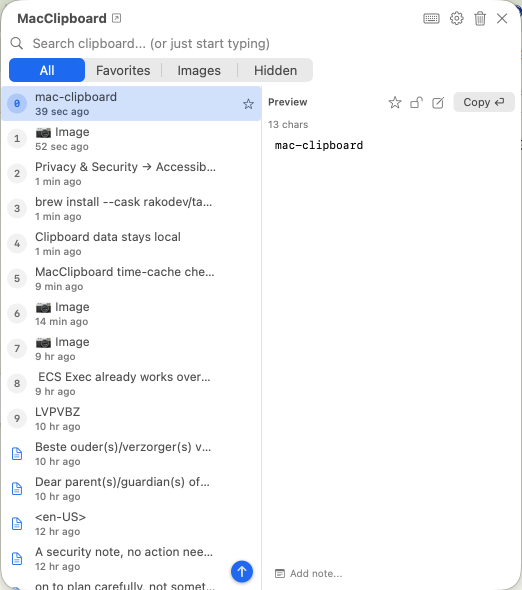

# MacClipboard 📋

Lightweight macOS menu bar clipboard manager that keeps track of your clipboard history with quick access and global hotkey support. Built to be fast, unobtrusive, and native to macOS.

<p align="center">
  
</p>

## Why

Managing clipboard history shouldn't be complicated. MacClipboard gives you instant access to your recent copies with a clean interface and global hotkey support.

## Key Features

* 📋 **Automatic clipboard tracking** - Captures text, images, and files as you copy them
* ⌨️ **Global hotkey** - Press `Cmd+Shift+V` to open clipboard history from anywhere, or record your own
* ⭐ **Favorites** - Save important items that persist indefinitely
* 🔒 **Sensitive mode** - Hide content from shoulder surfing with `Cmd+H` (reveal with `Cmd+V` or eye icon)
* ⏸️ **Pause capture** - Stop saving new copies before a screen share or a customer's account, without quitting; the menu bar icon shows a struck-through clipboard while it is off
* 📝 **Notes** - Add descriptions to items for easier searching (e.g., "work password", "API key")
* 🔍 **Live search** - Find clipboard items quickly with real-time filtering (searches content and notes)
* 👀 **Smart preview** - Click any item to see full content before pasting
* 🖼️ **Image preview** - Full-size image preview with `Cmd+Z`
* 🔎 **Read text from an image** - Press `Cmd+R` on a screenshot to save the text in it as a new item, recognised on your own Mac
* 🎨 **Colour swatches** - A clip that is a colour (`#3A7BD5`, `rgb(58, 123, 213)`) shows the colour beside it
* 🎯 **Quick paste** - Click an item, or select it and press Enter
* 💾 **Persistent storage** - History saved to disk, survives app restarts
* 📁 **Multiple content types** - Supports text, images, and file paths
* 🗑️ **Bulk delete** - Select multiple items with `Cmd+Click` for deletion
* 🌗 **Dark & Light mode** - Automatically matches your system appearance
* ⚡ **Minimal footprint** - Native SwiftUI app with low memory usage
* 🔧 **Highly configurable** - Adjust history size, storage limits, retention days
* 🚀 **Launch at login** - Starts automatically when you log in (enabled by default)

## Installation

### Homebrew (Recommended)

```bash
brew tap rakodev/tap
brew install --cask macclipboard
```

Or in one command:

```bash
brew install --cask rakodev/tap/macclipboard
```

To update later:

```bash
brew update && brew upgrade --cask macclipboard
```

After installation, launch MacClipboard and enable Accessibility permissions (see [After Installation](#after-installation-required)).

### Direct Download

Download the latest release from [GitHub Releases](https://github.com/rakodev/mac-clipboard/releases):

1. Download `MacClipboard-Installer.dmg` (or `MacClipboard.zip`)
2. Open the DMG and drag MacClipboard to Applications
3. Launch MacClipboard from Applications or Spotlight
4. **Enable permissions** (see below)

### After Installation (Required)

MacClipboard needs Accessibility permissions for the global hotkey and auto-paste to work:

1. Open **System Settings**
2. Go to **Privacy & Security** → **Accessibility**
3. Find **MacClipboard** in the list and enable it
4. If prompted, click "Open System Settings" to go there directly

Without this permission, the `Cmd+Shift+V` hotkey and automatic paste won't work.

### Build from Source

See [Development Guide](docs/DEVELOPMENT.md) for building from source and contributing.

## Quick Start

After installation, the menu bar icon appears. Press `Cmd+Shift+V` or click it to open clipboard history.

## Usage

### Opening Clipboard History

* **Menu bar icon**: Left-click the clipboard icon in your menu bar
* **Global hotkey**: Press `Cmd+Shift+V` from any application, or whichever shortcut you recorded
* **Right-click menu**: Right-click the icon for quick actions

### Pausing Capture

Before a screen share, a demo, or an hour in someone else's account, stop MacClipboard recording
without quitting it:

* **Right-click the menu bar icon** and choose **Pause Capture**, or click the pause button in the
  clipboard window
* The menu bar icon becomes a clipboard with a line through it, so the pause is visible while you
  work in other apps, and it stays paused until you resume, including after a restart
* Nothing you copy while paused is saved, and resuming does not pick up whatever is on the
  clipboard at that moment: only your next copy is saved
* Your existing history, favorites and notes are untouched, and pasting from MacClipboard still
  works normally

### Keyboard Shortcuts

| Shortcut | Action |
|----------|--------|
| `Cmd+Shift+V` | Open clipboard history (global, default; rebindable in Settings) |
| `Cmd+E` | Edit a copy of the selected text item |
| `Cmd+F` | Switch between All / Favorites view |
| `Cmd+D` | Toggle favorite on selected item |
| `Cmd+H` | Toggle sensitive/hidden on selected item |
| `Cmd+V` | Temporarily reveal sensitive item content |
| `Cmd+N` | Focus note field for selected item |
| `Cmd+Backspace` | Delete items (shows confirmation) |
| `Cmd+R` | Read the text in the selected image into a new item |
| `Cmd+Z` | Open image preview (when image selected) |
| `Cmd+Click` | Add an item to the selection |
| `Cmd+↑` `Cmd+↓` | Extend the selection up or down (`Shift` works too) |
| `Cmd+M` | Copy the selected items merged into one, top to bottom |
| `Cmd+Shift+M` | Split the selected item into one item per line |
| Any letter or digit | Start searching |
| `Enter` | Paste selected item |
| `Shift+Enter` | Paste selected item without its formatting |
| `↑` `↓` | Navigate between items |
| `Option+↑` | Jump to the top of the list |
| `Escape` | Close clipboard window / unfocus fields |

While editing a copy:

| Shortcut | Action |
|----------|--------|
| `Cmd+S` | Save as a new item |
| `Cmd+Enter` | Save as a new item and paste it |
| `Enter` | Add a line (editing never pastes) |
| `Escape` | Cancel the edit |

### Using Clipboard Items

* **Preview**: Click any item to see full content in the preview panel
* **Paste**: Click an item, or select it with the arrow keys and press Enter
* **Search**: Just start typing over the list, digits included; `Tab` focuses the search field
* **Formatting**: A clip copied from Word, Notes, Pages, Mail, TextEdit, a browser, Slack or any
  other app that offers styled text keeps its bold, italics, colours and links, and pasting it puts
  them back. Those items are marked with a text icon in the list and in the preview. To paste one as
  plain text instead, press `Shift+Enter` or click **Plain ⇧⏎**. The formatting stays stored either
  way, so the next paste of the same item can keep it. Text from a terminal or a code editor has no
  formatting to keep and behaves exactly as it always did
* **Favorite**: Click the star icon or press `Cmd+D` to save important items
* **Sensitive**: Press `Cmd+H` to hide content - useful when showing clipboard in public. Press `Cmd+V` or click the eye icon to temporarily reveal (auto-hides when you switch items or close)
* **Edit a copy**: Click the preview text (the caret lands where you clicked), press `Cmd+E`, or click the pencil icon. Saving adds a new item and leaves the original untouched. An edit of a hidden item stays hidden. Drag over the preview text to select it without opening the editor.
* **Notes**: Add a note to any item (press `Cmd+N` or click the note field) - useful for labeling passwords, API keys, etc.
* **Search**: Start typing to filter items instantly (searches content and notes)
* **Multi-select**: Hold `Cmd` and click to select multiple items, or hold `Cmd` (or `Shift`) with
  `↑` and `↓` to grow the selection without leaving the keyboard. Reversing direction gives back
  what the presses before it took, and items picked with `Cmd`-click are kept
* **Merge**: With several items selected, press `Cmd+M` or right-click and choose **Copy Merged** to
  join them into one new clip, in the order they appear in the list, top to bottom, one per line. The
  new clip goes on your clipboard ready to paste, and the items it came from are left as they were.
  Anything selected that is not text, such as an image, is left out, and the action says how many
  before and after. A merge that includes a hidden item is hidden too
* **Split**: The other direction. With a multi-line text item selected, press `Cmd+Shift+M` or
  right-click and choose **Split** to turn it into one item per line, ready to paste one at a time.
  Copy a column out of a spreadsheet, split it, and the lines are in the list in the order they were
  written, first line at the top. Blank lines are left out, nothing else is trimmed, the original
  item stays as it was, and a split of a hidden item stays hidden. Above 100 lines it asks first
* **Colours**: A clip that is nothing but a colour, such as `#3A7BD5`, `#f53`, `#3A7BD580` or
  `rgb(58, 123, 213)`, shows that colour as a swatch in the list and in the preview, with the hex
  spelled out beside it when the clip is written some other way. A colour mentioned inside other
  text gets no swatch, so a stylesheet does not come back covered in them
* **Read the text in an image**: With an image selected, press `Cmd+R` or click the text button in the
  preview toolbar. The text is recognised on your own Mac, with nothing sent anywhere, and saved as a
  new item at the top of the list, marked so you can tell it from something you copied yourself. The
  image is left exactly as it was, and what you had copied stays on your clipboard. It only runs when
  you ask: nothing is recognised in the background. An image with no readable text in it says so and
  adds nothing, and a hidden image has to be revealed first
* **Image zoom**: Press `Cmd+Z` on an image to see full-size preview

### Content Types Supported

* **Text**: Code snippets, URLs, notes, messages
* **Formatted text**: The styling a clip was copied with, kept beside the plain text and written
  back when you paste it
* **Images**: Screenshots, copied images from web/apps
* **Files**: File paths and multiple file selections

## Permissions

MacClipboard automatically requests:

* **Accessibility**: Required for automatic paste functionality and global hotkey (`Cmd+Shift+V`)
- **Clipboard access**: Automatically granted for clipboard monitoring

## Settings

Access settings via the gear icon or right-click menu.

### General

* **Launch at login**: Start MacClipboard automatically when you log in (enabled by default)

### Clipboard History

* **Maximum items**: 10 - 1,000 items (default: 200)
* Older items automatically removed when limit is reached

### Clipboard Persistence

* **Save clipboard history** (default: on): writes what you copy to disk, so your history is still
  there the next time you launch. With it off, only the current session is kept and nothing new is
  written. Switching it off does not delete what is already saved, so MacClipboard offers to delete
  that for you at the moment you switch it off, and says how much there is.
* **Clear history when MacClipboard quits** (default: off): saves your history as usual while you
  work, then deletes it when you quit, including a quit from a logout or an update. Favorites are
  kept. A force quit or a power cut leaves the history on disk, because nothing gets to run at that
  point.
* **Save images to disk**: Store images for faster loading (default: on)
* **Storage limit**: 10MB - 10GB (default: 1GB)
* **Keep items for**: 1 - 365 days (default: 60 days)
* **Favorites**: Kept indefinitely, regardless of retention settings

### Privacy

Capture can also be switched off outright, from the right-click menu or the clipboard window; see
[Pausing Capture](#pausing-capture).

Two settings decide what is never recorded in the first place. Both are off by default, so nothing
changes until you turn them on:

* **Never save clips marked confidential by the source app** (default: off): password managers mark
  what you copy as confidential. With this on, those clips are not added to history and never
  written to disk. They are gone rather than hidden, so a password you wanted for a minute is not
  there either.
* **Never save clips from these apps** (default: empty): pick apps, by bundle, whose clips are not
  saved. MacClipboard checks the clipboard every 0.8 seconds, so the app in front when a change is
  noticed is a good guess at the source of the clip, not a certainty: copy and switch apps within
  the same moment and the clip is saved.

Two further settings hide items that *are* saved, revealed with `Cmd+V`:

* **Auto-hide sensitive content** (default: off): API keys, tokens, and other formats that are
  recognisable
* **Auto-hide password-like strings** (default: off): 8-64 characters of mixed case, digits, and
  symbols. May have false positives.

### Global Hotkey

* Enable/disable the global shortcut
* Record your own: click the shortcut, then press the combination you want. `Cmd+Shift+V` is the
  default, and it is also "Paste and Match Style" in many apps, so change it here if the two
  collide. Escape leaves it as it was, and Reset puts the default back.
* A combination needs `Cmd`, `Option` or `Control`, or a function key. `Cmd` plus a single key is
  refused, because a global hotkey would take that key away from every app you run.

### Keyboard Shortcuts

* Enable/disable in-app keyboard shortcuts (`Cmd+D`, `Cmd+H`, `Cmd+F`, `Cmd+N`, `Cmd+R`, `Cmd+Backspace`, `Cmd+Z`, etc.)

## Requirements

macOS 13.0 (Ventura) or later.

## Update

If installed via Homebrew, run `brew update && brew upgrade --cask macclipboard` (see [Installation](#homebrew-recommended)).

If installed manually, download the latest version from [GitHub Releases](https://github.com/rakodev/mac-clipboard/releases) and replace the app in your Applications folder.

## Uninstall

If installed via Homebrew:

```bash
brew uninstall --cask macclipboard
```

If installed manually, quit the app and run:

```bash
rm -rf /Applications/MacClipboard.app
defaults delete com.macclipboard.app 2>/dev/null || true
```

## Privacy & Security

* **Clipboard data stays local**: Clipboard history is stored only on your Mac and is never synced or uploaded
* **Local storage only**: History stored in `~/Library/Application Support/MacClipboard`
* **Explicit update checks only**: The optional "Check for Updates" action contacts the GitHub Releases API; no clipboard content is sent
* **Text recognition runs on your Mac**: `Cmd+R` reads an image with Apple's on-device Vision framework. No image and no text leaves the machine, and it only runs when you ask
* **Configurable retention**: Set how long items are kept (or disable persistence entirely)
* **Exclusions**: Clips marked confidential by the source app, and clips from apps you name, can be
  dropped before they are recorded at all (see [Privacy settings](#privacy))
* **Pause**: Recording can be switched off entirely, from the menu bar, for as long as you want
  (see [Pausing Capture](#pausing-capture))
* **Secure by design**: Only accesses clipboard when content changes
* **Minimal permissions**: Only needs accessibility for hotkey and auto-paste

## Contributing

See [Development Guide](docs/DEVELOPMENT.md) for how to build, contribute, and submit PRs.

## Troubleshooting

**Global hotkey not working?**

* Check System Settings > Privacy & Security > Accessibility
* Ensure MacClipboard is allowed
* If another app already uses the same combination, MacClipboard cannot register it. The popover
  and Settings both say so when this happens; record a different shortcut, or click the menu bar
  icon to open MacClipboard in the meantime.

**MacClipboard is switched on in Accessibility but still says permission is missing?**

macOS records the permission against the app's code signature as it was when you granted it. If
that record no longer matches the installed app, the switch keeps showing as on while macOS
refuses the app. Open the popover and click **Repair** in the orange banner: it removes the stale
record and asks for permission again. The manual equivalent is:

```bash
tccutil reset Accessibility com.macclipboard.app
open -a /Applications/MacClipboard.app
```

**More than one MacClipboard in Spotlight, or the banner says another copy has the permission?**

Keep exactly one copy, in your Applications folder. macOS grants Accessibility access to one
specific copy of an app, so a leftover copy in Downloads, on the desktop, or in a second
Applications folder makes auto-paste fail while the switch stays on. MacClipboard now says so on
launch and lists the copies under **Settings > Installation**, where **Move Others to Trash**
cleans them up. To check by hand:

```bash
mdfind "kMDItemCFBundleIdentifier == 'com.macclipboard.app'"
```

**Opened MacClipboard straight from the DMG or from Downloads?**

Do not run it from there. macOS runs a quarantined app from a temporary location that changes on
every launch, so no permission can ever stick. MacClipboard offers to move itself to Applications
when it detects this; accept the offer, or drag the app to Applications yourself and open it from
there.

**App not capturing clipboard?**

* Try quitting and restarting the app
* Check if another clipboard manager is running

**Can't see menu bar icon?**

* The icon appears as a clipboard symbol in your menu bar
* Try adjusting menu bar item spacing in System Settings

**Menu bar icon click not working?**

* Left-click the icon to open clipboard history
* Right-click the icon for settings and other options
* If clicks aren't responding, try restarting the app

**Persistence not working?**

* Right-click the menu bar icon and select "Settings..."
* Ensure "Enable Persistence" is toggled on (enabled by default)
* Check available storage space if items aren't being saved
* Persistence is disabled if storage limit is exceeded

**Focus not returning after using clipboard?**

* When you close the clipboard (Escape or click outside), focus automatically returns to your previous application
* If focus doesn't restore properly, ensure the clipboard app has accessibility permissions
* This works for both keyboard shortcuts and clicking outside the popover

### Homebrew Installation Issues

**"Refusing to load cask ... from untrusted tap"?**

Newer versions of Homebrew ask you to trust third-party taps before installing from them. Trust the tap once, then retry:

```bash
brew trust rakodev/tap
brew install --cask macclipboard
```

**"It seems there is already an App at '/Applications/MacClipboard.app'"?**

This happens when a copy of MacClipboard already exists in Applications (for example, a previous manual download) that Homebrew did not install. Quit MacClipboard first, then let Homebrew take over that copy:

```bash
brew install --cask --force macclipboard
```

If you would rather start clean, remove the old copy first and then install normally:

```bash
rm -rf /Applications/MacClipboard.app
brew install --cask macclipboard
```

After a force install the app is replaced on disk, so macOS may ask you to enable Accessibility again under System Settings > Privacy & Security > Accessibility.

**"Cask 'macclipboard' is not installed" when running `brew upgrade`?**

`brew upgrade` only works once the app is installed and tracked by Homebrew. If you installed manually before, run `brew install --cask macclipboard` (see above) so Homebrew adopts it; afterwards `brew upgrade --cask macclipboard` will work as expected.

## License

MIT. See [LICENSE](LICENSE).

---

Built with ❤️ for better clipboard management on macOS.
